# CyberQuest — Pentest RPG

> **Projet collectif.** CyberQuest a été réalisé en équipe par **BouazzaZayd**, **isselmou**, **JamaiAli** et **Aziz Baoueb** dans le cadre de la formation STI3A à l'INSA Centre-Val de Loire. Dépôt d'origine : [JamaiAli/CyberquestProject](https://github.com/JamaiAli/CyberquestProject). Ce dépôt est maintenu par [@aziz3r](https://github.com/aziz3r), auteur de l'architecture standalone sécurisée (branche `proof-of-concept`) ; l'historique Git complet et les droits de chaque auteur sont conservés — voir la section *Auteurs*. Code sous licence MIT, © 2026 Ali Jamai et contributeurs.

Un jeu de simulation de pentest où tu incarnes un hacker infiltrant le réseau de NEXUS Corp. Déplace ton personnage GHOST sur une carte top-down vue de dessus, approche-toi des machines cibles, et attaque-les depuis le terminal intégré. Récupère les 4 flags avant la fin du compte à rebours de 6 minutes.

---

## Différence entre les Versions

> **Version `master` (Client-Serveur)**
> Version complète avec un backend Node.js (SQLite) et un frontend React. Permet de gérer la persistance en base de données, la sécurité des scores, l'authentification et l'intégration de véritables appels d'API (ex: l'IA Sentinel via GROQ).
> *Utilité : Déploiement réel en production sécurisée.*

> **Version `proof-of-concept` (Standalone PoC - Actuelle)**
> Version allégée 100% Frontend. Le moteur de jeu a été migré dans le navigateur (`frontend/src/engine/`) et l'état est sauvegardé via `localStorage`. Il n'y a plus de backend, plus de base de données.
> *Utilité : Démonstrations rapides, salons, hackathons, ou pour jouer hors-ligne.*

**Modifications spécifiques et Sécurisation du PoC :**
- **Sans Backend** : Le dossier `backend` n'est plus utilisé. La logique serveur (`commandEngine.js`) a été entièrement migrée dans le navigateur. L'état du jeu est sauvegardé localement via `localStorage`.
- **Optimisation des Performances (Vite)** : Mise en place d'un système de *Code Splitting* (Chunking) natif séparant le moteur React, le Terminal xterm.js et le code du jeu pour un chargement instantané.
- **SAST & DAST (0 Vulnérabilités)** : L'application a été auditée et corrigée pour éliminer toutes les failles de dépendances. Le code React ne présente aucune faille XSS (`dangerouslySetInnerHTML` non utilisé).
- **Défense en Profondeur (CSP)** : Intégration d'une politique de sécurité stricte (*Content Security Policy*) bloquant l'exécution de tout script externe malveillant par le navigateur.
- **Sauvegardes Signées** : Les fichiers de sauvegarde locale du joueur sont hachés et signés cryptographiquement. Toute altération manuelle pour tricher corrompt la signature et détruit la sauvegarde.
- **Obfuscation des Drapeaux** : Tous les "flags" (ex: `CQ{...}`) dans le code source ont été obfusqués et encodés en Base64 pour empêcher la triche par simple inspection du code.
- **Anti-Debugging Actif** : Bloqueur intégré désactivant le clic droit et les raccourcis vers les Outils de Développement (F12, Ctrl+Shift+I).

---

## Installation & Lancement (Standalone)

Puisque vous êtes sur la branche `proof-of-concept`, **aucun backend n'est requis**.

```bash
cd frontend
npm install
npm run dev
```

Le jeu démarre sur **http://localhost:5173**

---

## Comment tester le projet

### Étape 1 — Sélection du personnage

Au lancement, l'écran de sélection affiche trois personnages :
- **GHOST** — Hacktiviste (+20% XP exploit web)
- **PHANTOM** — Spécialiste réseau (+20% XP scans nmap)
- **VIPER** — Social Engineer (+20% XP hydra & creds)

Clique sur un personnage, tape ton alias, puis clique **LANCER LA MISSION**.

### Étape 2 — Séquence d'intro

L'intro cinématique affiche le briefing mission. Clique sur **COMMENCER L'INFILTRATION** pour entrer dans le jeu.

### Étape 3 — Se déplacer sur la carte

La carte représente le réseau NEXUS Corp vu de dessus, la nuit. GHOST apparaît juste en dessous de sa base Kali Linux (en haut au centre).

| Touche | Action |
|--------|--------|
| `↑` `↓` `←` `→` | Déplacer GHOST case par case |

Quand GHOST s'approche d'une machine, une **bulle d'interaction** apparaît au-dessus de lui et ORACLE envoie un message dans le terminal.

> **Important** : les flèches déplacent exclusivement GHOST sur la carte. Toutes les autres touches (lettres, chiffres, Entrée) vont dans le terminal.

### Étape 4 — Tester la chaîne d'attaque complète

Lance le backend, ouvre le jeu, puis joue la séquence suivante dans le terminal :

#### A. Cartographier le réseau
```
nmap 192.168.1.0/24
```
Les câbles réseau s'illuminent sur la carte. ORACLE guide vers les premières cibles.

#### B. Attaquer le Web Server (FACILE)

Marche jusqu'au Web Server (bas-gauche), puis dans le terminal :
```
cd 192.168.1.10
recon
nmap -sV 192.168.1.10
nikto -h 192.168.1.10
dirb http://192.168.1.10
sqlmap -u http://192.168.1.10/login.php
cat /flag.txt
```
Flag : `CQ{w3b_s3rv3r_pwn3d}` — le bâtiment passe au vert sur la carte.

#### C. Attaquer le Mail Server (MOYEN)

Marche jusqu'au Mail Server (bas-droite) :
```
cd 192.168.1.20
recon
nmap -sV 192.168.1.20
hydra -l admin -P /usr/share/wordlists/rockyou.txt 192.168.1.20 smtp
nc 192.168.1.20 25
cat /flag.txt
```
Flag : `CQ{m41l_s3rv3r_0wn3d}` — le DB Server se déverrouille sur la carte.

#### D. Attaquer le DB Server (MOYEN)

Marche vers le centre (les couloirs de bypass autour du DB Server permettent de le contourner) :
```
cd 192.168.1.30
recon
nmap -sV 192.168.1.30
sqlmap --dump
find / -perm -u=s 2>/dev/null
sudo python3 -c "import os; os.system('/bin/bash')"
cat /flag.txt
```
Flag : `CQ{db_dump_g0t}` — le Domain Controller se déverrouille et la barrière Firewall apparaît.

#### E. Attaquer le Domain Controller (DIFFICILE — boss)

Traverse la zone Firewall (bas-centre) :
```
cd 192.168.1.100
recon
nmap -sV 192.168.1.100
searchsploit ms17-010
nc 192.168.1.100 445
whoami
sudo -l
cat /flag.txt
```
Flag : `CQ{d0m41n_4dm1n_pwn3d}` — écran de victoire avec Matrix rain.

### Étape 5 — Autres commandes utiles

| Commande | Description |
|----------|-------------|
| `hint` | Indice sur la phase actuelle |
| `help` | Liste toutes les commandes disponibles |
| `ls` | Lister les machines du réseau |
| `whoami` | Afficher ton identité et contexte |
| `exit` | Quitter la machine en cours |
| `scores` | Afficher le tableau des scores |
| `clear` / `Ctrl+L` | Effacer le terminal |
| `Ctrl+C` | Copier la sélection / annuler la commande |
| `Tab` | Autocomplétion des commandes |

### Étape 6 — Vérifier les écrans spéciaux

| Condition | Écran |
|-----------|-------|
| Timer atteint 0 (6 min écoulées) | Game Over glitch rouge |
| 4 flags récupérés | Victoire Matrix rain vert |
| ORACLE à 2 min restantes | Message d'alerte dans le terminal |
| ORACLE à 1 min restante | Message critique dans le terminal |

---

## Diagramme de séquence

Flux complet d'une session de jeu, du lancement au flag final.

```mermaid
sequenceDiagram
 actor P as Joueur
 participant UI as App.jsx (React)
 participant GM as GameMap (Canvas)
 participant T as Terminal (xterm.js)
 participant CE as commandEngine.js (Local)

 P->>UI: Sélectionne personnage + alias
 UI->>UI: screen = 'intro'
 UI-->>P: IntroScreen — briefing cinématique
 P->>UI: Clique "Commencer l'infiltration"
 UI->>UI: screen = 'game' · timer 360 s démarre

 rect rgb(0, 30, 0)
 note over P,GM: Déplacement GHOST sur la carte
 loop Touche flèche pressée
 P->>GM: ↑ ↓ ← → (window keydown)
 GM->>GM: Vérifie collision NETWORK_MAP
 GM->>GM: ghostTileRef ← nouvelle position
 GM->>GM: Détection proximité machine (Manhattan ≤ 1)
 GM-->>T: ORACLE › "cd {ip}" si nouvelle machine proche
 GM-->>P: Bulle interaction au-dessus de GHOST
 end
 end

 rect rgb(0, 0, 40)
 note over P,CE: Commandes pentest dans le terminal
 loop Commande soumise
 P->>T: tape commande (ex : nmap -sV 192.168.1.10)
 T->>CE: handleCommand(command, state)
 CE->>CE: vérifie phase · met à jour gameState
 CE-->>T: {output, newState, effect, pedagogie}
 T-->>P: affiche output (ANSI colors)
 UI->>GM: gameState mis à jour → redessine carte
 GM-->>P: bâtiment change couleur · câble devient vert
 end
 end

 alt Timer ORACLE — 2 min restantes
 UI-->>T: ORACLE › "Accélère, ils remontent ta connexion"
 end
 alt Timer ORACLE — 1 min restante
 UI-->>T: ORACLE › " 60 secondes. Ils arrivent."
 end

 alt 4 flags capturés (gameWon = true)
 UI->>UI: screen = 'victory'
 UI-->>P: Écran Victory — Matrix rain + score final
 else Timer = 0
 UI->>UI: screen = 'gameover'
 UI-->>P: Écran Game Over — glitch rouge
 end
```



---

## Diagramme d'architecture

Relations entre les composants frontend, le backend, et les flux de données.

```mermaid
graph TB
 subgraph FE[" Frontend — React + Vite (port 5173)"]
 direction TB

 App["App.jsx\n── machine à états ──\nselect › intro › game › fin\n── refs partagées ──\nwriteToTermRef · ghostTileRef\nnearbyMachineRef · timerRef"]

 subgraph Screens["Écrans"]
 CS["CharacterSelect.jsx\nGHOST / PHANTOM / VIPER\nalias + bouton lancer"]
 IS["IntroScreen.jsx\nbriefing cinématique"]
 GO["GameOver.jsx\nglitch rouge"]
 VIC["Victory.jsx\nMatrix rain"]
 end

 subgraph Game["Jeu principal"]
 HUD["HUD.jsx\ntimer · identité\nprogression machines"]
 GM["GameMap.jsx\nCanvas 2D 960×672\ntilemap · bâtiments\nGHOST lerp · câbles\nbulle interaction"]
 TRM["Terminal.jsx\nxterm.js v5\ncommandes pentest\nautocomplétion · historique"]
 MV["MachineView.jsx\nphases pentest\nétat machine active"]
 PP["PedaPanel.jsx\nguide contextuel\nindices par phase"]
 end

 subgraph Engine["Moteur Logique (Standalone)"]
 CE["commandEngine.js\nnmap · cd · recon\nphases · flags · ORACLE"]
 GS["gameState.js\nÉtat local (localStorage)\nxp · level · gameWon"]
 CU["cryptoUtils.js\nChiffrement de sauvegarde"]
 end

 MAP["map.js\nNETWORK_MAP 20×14\nGHOST_SPAWN\nMACHINE_POSITIONS\nCABLE_LINKS"]
 end

 App -->|"affiche selon screen"| CS & IS & GO & VIC
 App -->|"affiche"| HUD & GM & TRM & MV & PP
 GM -->|"importe"| MAP
 App -->|"importe GHOST_SPAWN\nMACHINE_POSITIONS"| MAP

 App -->|"ghostTileRef\nnearbyMachineRef"| GM
 App -->|"onWriteRef → ORACLE alerts"| TRM
 TRM -->|"handleCommand(cmd)"| CE
 CE <-->|"lecture / écriture"| GS
 CE -->|"{output, newState}"| TRM
 TRM -->|"newState"| App
 App -->|"gameState"| GM & HUD & MV & PP
 CU -->|"Signature"| GS

 style FE fill:#001a00,stroke:#00ff41,color:#00ff41
 style APP fill:#002200
 style MAP fill:#001122
 style Engine fill:#002211,stroke:#00ffaa
```



---

## Architecture du jeu

```
cyberquest/
└── frontend/
 └── src/
 ├── engine/
 │ ├── commandEngine.js # Moteur de jeu local : commandes, scénarios, flags
 │ ├── gameState.js # Gestion d'état local et persistance (localStorage)
 │ └── cryptoUtils.js # Signatures de sécurité des sauvegardes
 ├── map.js # Tilemap 20×14 : grille, positions machines, câbles
 ├── components/
 │ ├── CharacterSelect.jsx # Sélection GHOST/PHANTOM/VIPER
 │ ├── IntroScreen.jsx # Cinématique de briefing
 │ ├── GameMap.jsx # Carte top-down Canvas (bâtiments, GHOST, câbles)
 │ ├── Terminal.jsx # Terminal xterm.js (commandes pentest)
 │ ├── HUD.jsx # Timer, identité, progression
 │ ├── MachineView.jsx # Vue phases pentest par machine
 │ ├── PedaPanel.jsx # Guide pédagogique contextuel
 │ ├── GameOver.jsx # Écran de fin (temps écoulé)
 │ └── Victory.jsx # Écran de victoire (Matrix rain)
 ├── sounds.js # Sons synthétisés (Web Audio API, sans fichiers)
 ├── styles/main.css # Animations, CRT scanlines, thème cyberpunk
 └── App.jsx # Machine à états : select → intro → game → fin
```

---

## Technologies

| Composant | Stack |
|-----------|-------|
| Application | React 18, Vite, HTML Canvas 2D, xterm.js v5 |
| Sécurité CSP | Meta balise stricte intégrée |
| Audio | Web Audio API (aucun fichier audio) |
| État jeu | Sauvegardes chiffrées signées (localStorage) |
| Graphismes | Canvas `requestAnimationFrame` + lerp pour les animations |

---

## Auteurs

- **BouazzaZayd** — Moteur backend & logique pentest
- **isselmou** — Carte interactive & terminal
- **JamaiAli** — Interface, intégration & UX
- **Aziz Baoueb** — Co-conception initiale & Architecture standalone (branche `proof-of-concept`)
